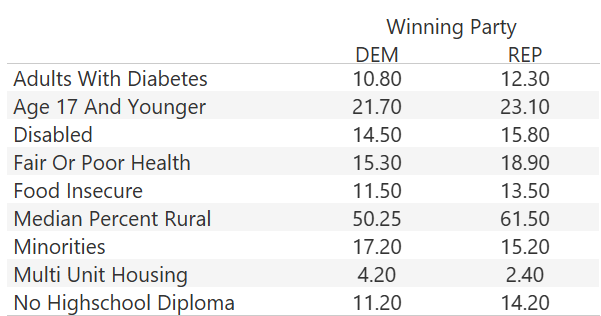

# COVID-and-the-2020-US-Election

## Purpose

An analysis relating COVID-19 cases, demographics and mortality to the outcomes and participation in the 2020 US Election.

## Reason

We selected this topic because the COVID-19 pandemic is our daily reality and the tactics to manage it is closely linked to politics.

## Description

All of our data came from Kaggle, linked below:

### COVID-19

https://www.kaggle.com/johnjdavisiv/us-counties-covid19-weather-sociohealth-data

### 2020 Election

https://www.kaggle.com/unanimad/us-election-2020

## Project Outline

### Cleaning the Data and Creating the Database

In order to create the database for our project we used the previously mentioned Kaggle datasets - one for election results and one containing COVID19 cases. Although these datasets were robust, for our purposes we followed the following steps to clean each (all of which are also detailed in the "Cleaning_Data.ipynb" file):

1. First, the COVID-19 dataset was loaded as a DataFrame and reduced to columns that the team deemed important - 26 columns in total.
2. All "NA" values were dropped from the new DataFrame.
3. All datatypes were examined and converted into more appropriate datatypes - for easier merging in PostgreSQL.
4. After reding in the 2020 Election data and examining the shape and datatypes for the DataFrame, it was determined that no changes had to be made.

After cleaning the initial kaggle datasets and saving the resulting DataFrames as CSV files we began the construction of the Database in PostgreSQL. First, two table schemas were created based on an ERD made in quickdatabasediagrams.com, which in turn was based on the datatypes established when cleaning the fiels in Jupyter notebook. Both are shown below:

After the schemas for each dataset were created, the newly saved CSV files were imported into their respective tables as the last step in PostgreSQL.

The final step to creating our final static database for use in the machine learning model and when creating our visualizations in Tableau involves merging the two tables created in PostgreSQL through a connection in Jupyter Notebook. As detailed in the "Final_database.ipynb" file, first we establish a connection with our PostgreSQL server and the appropriate tables using psycogpg2. Within the same cell in our jupyter notebook, we then execute a SQL based query to merge the aforementioned tables into one static source that gives us the stats for each state while also indicating which political party won on election day. All details from this process are shown below:

### Creating the Machine Learning Model

We wanted to determine if a there was a connection between the state election outcome and the data in the individual counties.

Our desired outcome for the model was Winning Party, Democrat (Dem) or Republican (Rep).

We dropped the state, county, cate, Fips, total_population, latitude, and longitude fields to see if to prevent overfitting the model.

The fields we used can be seen below:

We leveraged the OneHotEncoder function to change the categorical fields to numerical values and remerged them with the original data frame.

Then we selected our target outcome and dropped the winning_party_Dem & wining_party_Rep columns.

After splitting our data into train & test, we set up a standard scaler instance.

We then set up our model with three hidden layers. We chose to use Relu for the three hidden layers and sigmoid for the output layer.

We then ran the model, we achieved an 89% accuracy.

Model results:

Overall, the model seemed to be relatively accurate in predicting the outcome of the election.

There seems to be a substantial difference in a few fields we will cover in the visualization section that may explain this outcome.

### Creating Visualizations

We have several visualizations demonstrating connections and assumptions we can make between COVID-19 data and Election data.

- We created a map of the United States that visualizes the amount of positive COVID-19 cases in each county. This map can be filtered by month to show the cumulative changes over time. The map also showcases the winning election results by county.

- Map of the United States that shows the sum of positive COVID-19 cases on Election Day and the winning party per state.

- Map of cases based on population

- Line graphs demonstrating cumulative COVID-19 cases by population separated by states won by each party.

- Chart of population statistics for United States based on winning party of the 2020 election. This shows how the majority voters relate to each other based on health, demographics, education, and economy.

- Map of United States visualizing the poplulation sizes of each county and color-coded by winning party of the Election. This map combined with the earlier maps helps to explain higher number of COVID-19 cases correlating to higher populations.

- Combined chart demonstrating new deaths (line graph) and new cases (bar chart) reported in the entire country, separated by winning party, from the very first reported case up to Election Day. 

## Questions

We hope to determine if there is any link between the amount of COVID-19 cases and deaths reported by county or state and how the same county or state participated in the 2020 election.

## Team Communication Protocols

Communicate through Slack messaging. 
Use Slack to determine meeting dates and times that work for everyone.
Primary meeting will take place weekly during Thursday class time. We also have met weekly, Sundays at 3pm.

## First Segment Submission

- Cleaned data and files used can be found in the "cleaning_data_and_creating_database" folder
- Analysis of the data using Machine Learning Model can be found in the "Analysis.ipynb" and "AlphabetSoupCharity.h5" files
- Final database storage can be found in the "final_database.csv" file
- Description of techonologies use can be found in the "technology.md" file

## Second Segment Presentation

https://docs.google.com/presentation/d/e/2PACX-1vTP0n4yQIcQ2OOcFKgNi3xtj7GjFxbRvgKEI2O1Yd9A2T7efM6UrFu-NI786WPtAq3ClL1kqwjduOUT/pub?start=false&loop=false&delayms=3000
